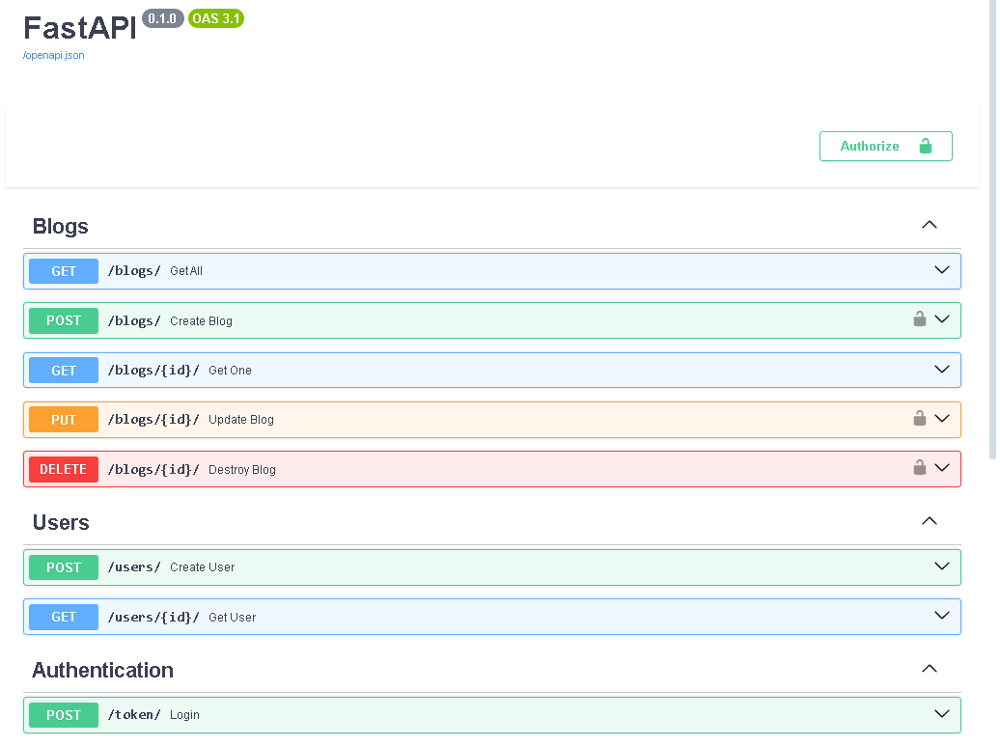
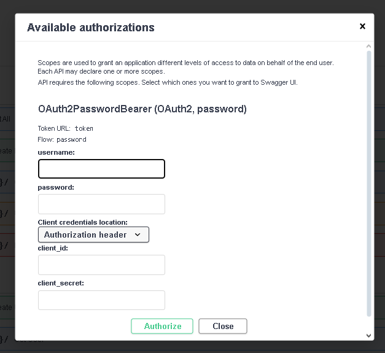
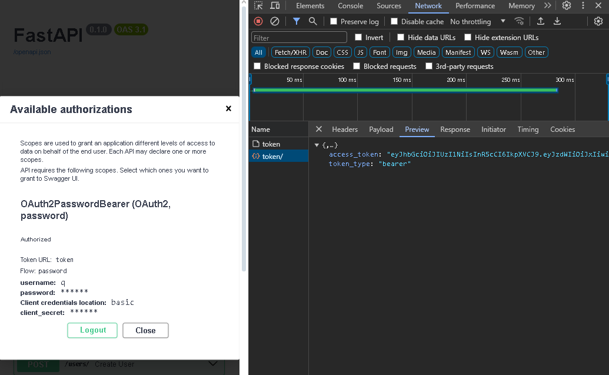

# Project "Blog"

> Welcome to the "Blog" project! It's a dynamic platform where users can express their thoughts, share stories, and engage with a community of like-minded individuals through articles.

## Overview

The "Blog" project is a platform where users can create, read, update, and delete articles, as well as interact with other users' content. It provides a secure and intuitive interface for managing blogs, ensuring a seamless experience for both writers and readers.

### Endpoints

* Users

    * POST `/users/`: Create a new user.
    * GET `/users/{id}/`: Get information about a user by their ID.


* Blogs

    * POST `/blogs/`: Create a new article in the blog.
    * GET `/blogs/`: Get a list of all articles in the blog. 
    * GET `/blogs/{id}/`: Get a specific article by its ID.
    * PUT `/blogs/{id}/`: Update an article by its ID.
    * DELETE `/blogs/{id}/`: Delete an article by its ID.


* Authentication and Access Token Retrieval

  * POST `/token/`: Obtain a JWT access token for user authentication.

### Authentication

JWT token is used for user authentication, ensuring secure access to the platform. Users can obtain an access token by sending a POST request to the /token/ endpoint with their email and password.

### Password Hashing

User passwords are stored in hashed form using secure encryption techniques to enhance security and protect user data.


## Quick Start:


1. Clone the repository:

```shell
git clone https://github.com/Anna728560/FastApiBlog.git
```


2. Set up a virtual environment:

```shell
python -m venv venv
source venv/bin/activate # or venv\Scripts\activate in Windows
```

3. Install dependencies:

```shell
pip install -r requirements.txt
````

4. Perform database migrations using Alembic:
```shell
alembic revision --autogenerate -m "Initial migration"
alembic upgrade head
```

5. Run the server:

```shell
uvicorn blog.main:app --reload
```


## Features:

* `Secure Authentication`: User authentication is handled securely using JWT tokens.
* `User-Friendly Interface`: The platform offers an intuitive interface for managing blogs, making it easy for users to create, read, update, and delete articles.
* `Engagement`: Users can interact with each other's content, fostering a sense of community and collaboration.
* `Enhanced Security:` Passwords are stored securely in hashed form, ensuring the protection of user data.

## Built With:

* Python - Backend programming language
* FastAPI - Web framework for building APIs with Python
* SQLAlchemy - SQL toolkit and Object-Relational Mapping (ORM) for Python
* JWT - JSON Web Tokens for secure authentication
* Alembic - Database migrations framework for Python's SQLAlchemy

## Documentation:



